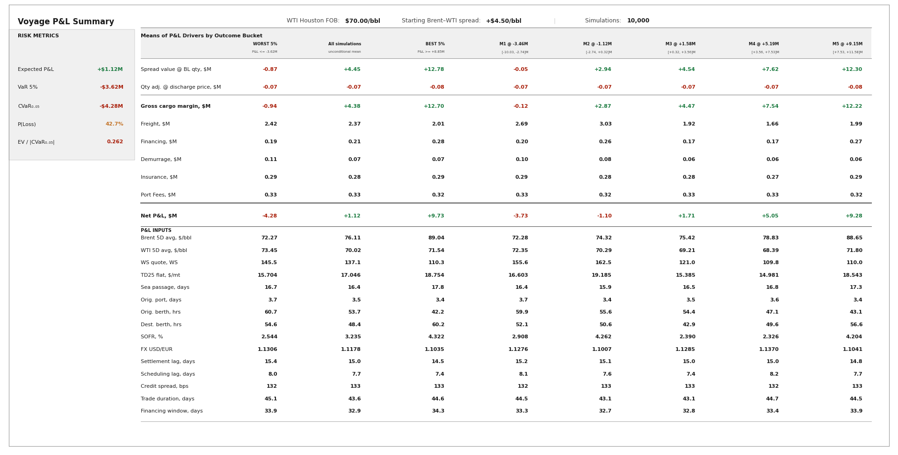
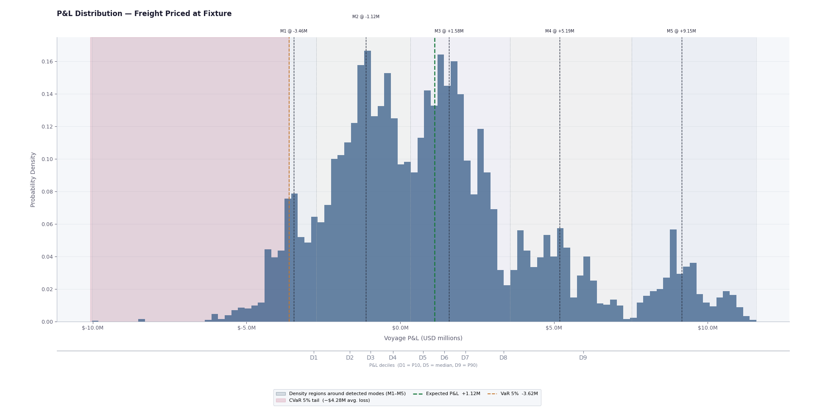
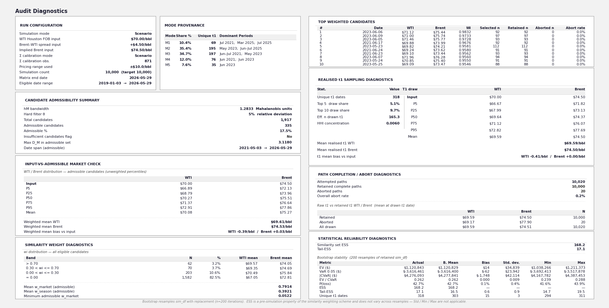
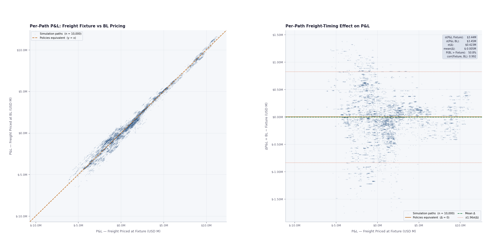
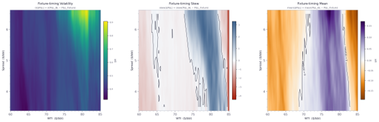
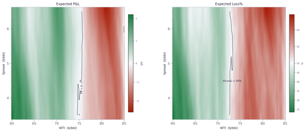

# USG–ARA Voyage P&L Model

Historical Monte Carlo simulation of voyage P&L for an unhedged Aframax WTI cargo from USG to ARA – seasonality, WTI and Brent level inputs generate P&L distributions, P&L attribution, fixture timing comparisons and downside-risk metrics.

---

## Commercial Problem

In physical crude markets, benchmark spreads alone do not determine whether a cargo is profitable. Instead, voyage P&L depends on whether the spread compensates for freight, financing, insurance, port fees, cargo losses and delays incurred between trade commitment and settlement. 

If ARA refineries have compatible light-sweet crude slate configurations, they can substitute local North Sea barrel supply with imported WTI to optimise refining margins if the import economics are favourable, creating arbitrage opportunities. In the US shale boom of 2011-2014, the oversupply of crude oil caused heavy WTI discounting, exacerbated by the US export ban. When the ban was lifted in 2015, exports surged and the spread reduced, resulting in thin margins for voyage charters. As their profitability is uncertain, the model aims to provide decision support using P&L attribution and risk metrics.

---

## Trade Structure

| Parameter | Specification |
|---|---|
| Commodity | Crude Oil |
| Origin proxy | WTI Houston FOB |
| Destination proxy | Dated Brent |
| Route | USG → ARA |
| Vessel class | Aframax |
| Cargo size | 730,000 bbl / 95,000 mt |
| Incoterms | FOB Buy USG, CIF Sell ARA |
| Hedge strategy | No derivatives use

**Execution Timeline:** At *t* = 0, freight is fixed and WTI is ordered under a Sales and Purchase Agreement (SPA) for pricing at the 5-day average around the Bill of Lading date (BL), with a Letter of Credit issued to the USG counterparty. The vessel transits to ARA after loading. The sell leg floats to the 5-day average of Dated Brent assessments around discharge. Financing accrues from BL to settlement under SOFR plus a credit spread. Total exposure spans arbitrage decision to ARA counterparty settlement.

**Sales and Purchase Agreement**

| Term | Specification |
|---|---|
| Cargo quantity | 730,000 bbl |
| Buy leg pricing | 5-day average of WTI Houston FOB assessments around BL |
| Sell leg pricing | 5-day average of Dated Brent assessments around discharge (floating) |
| Non-trading day rule | Nearest previous assessment used |
| Quantity sold | Cargo quantity at discharge |
| Settlement | Cash Against Documents (CAD) |
| Settlement limit | 30 days after discharge |
| Insurance coverage | Institute Cargo Clauses A, 110% of cargo value |
| Insurance premium | 0.50% |

**Charterparty**

| Term | Specification |
|---|---|
| Vessel class | Aframax |
| Freight fixing | Fixed at t=0, priced off associated WS Quote  |
| Payment timing | Full freight at BL (voyage charter) |
| NOR | Issued at port limits (WIBON) |
| Laytime allowance | 36 hours at origin and destination, SHINC, non-reversible |
| Laytime clock start | 6 hours after NOR |
| Laytime clock end | Hose disconnection |
| Demurrage rate | $75,000/day |
| Destination port fees | Fees incurred pre-discharge are borne by the charterer. Shipowner pays all fees incurred post-discharge |

**Financing**

| Term | Specification |
|---|---|
| Instrument | Letter of credit issued to USG counterparty |
| Valuation basis | Cargo value per SPA convention |
| Interest accrual | Daily from BL to settlement, ACT/365 |
| Rate | SOFR 30-day average + credit spread |
| Exposure window | BL → settlement |

**P&L components:** Gross cargo margin − Freight − Financing − Demurrage − Insurance − Port Fees 

---

## Example Outputs (Synthetic Dataset)

**Inputs:** WTI Houston FOB = $65.00/bbl · Brent–WTI Spread = +$4.50/bbl · n = 10,000

### Page 1 — Voyage P&L Summary



### Page 2 — P&L Distribution



### Page 3 — Audit Diagnostics



### Page 4 — Freight Comparison



### Page 5 — Freight Timing Surfaces



### Page 6 — Expected Value and 50/50 Surfaces



---

## Methodology

 Voyage P&L is simulated by sampling contiguous blocks from a historical dataset containing market and operational variables. Each simulation path begins from selecting an observation with similar seasonality and level of WTI and Brent, avoiding explicit parametric assumptions about the variables' dependence structure.

The simulation algorithm traces six operationally significant nodes according to the execution timeline through the historical dataset — from trade commitment to settlement — reading market and operational variables at each based on the trade structure. Variables unavailable due to confidentiality (demurrage, financing spread, port fees, handling losses and measurement errors) are assigned triangular distributions under conservative assumptions.

Full methodology is documented separately.

**Data inputs (Bloomberg):** Dated Brent, WTI Houston FOB, TD25 Flat Rate, WS Quote, SOFR, FX, AIS vessel tracking.

---

## Getting Started

```bash
git clone <repo-url>
cd FOB_USG-ARA_Voyage_PL_Model
python -m venv .venv && .venv\Scripts\activate  # Windows
source .venv/bin/activate                        # macOS/Linux
pip install -r requirements.txt
python main.py
```

Market inputs and simulation parameters are configured in `src/config.py`. Results are written to `outputs/`. Code will not run unless the historical dataset is present.

---

## Project Structure

```
src/
├── config.py       # Parameters and thresholds
├── pnl.py          # P&L sub-functions
├── simulate.py     # Simulation logic
└── report.py       # Output generation
data/
├── raw/            # Source market data
└── processed/      # Historical dataset
outputs/            # Simulation results
```

---

## Status

Unhedged simulation is complete. Adding hedged execution comparison long-term is an identified improvement.

---

## Author

**Adam Palmer** 

---

## Licence

See [LICENSE](./LICENSE).